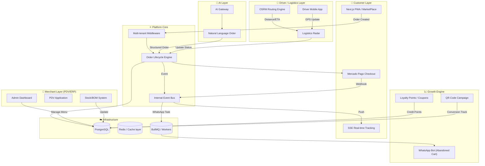

# Diagrama de Arquitetura da Plataforma X-Açaí

O diagrama abaixo visualiza o fluxo de dados e a interconexão entre as 8 camadas principais do sistema.

---

## 🛠️ Detalhes do Fluxo
1. **Pedido**: O cliente inicia o pedido no PWA/Marketplace.
2. **Multi-tenancy**: O middleware identifica qual restaurante/tenant deve processar a requisição.
3. **Eventos**: Após o pagamento PIX, o `EventBus` dispara tarefas para o BullMQ (WhatsApp) e atualizações em tempo real para o cliente via SSE.
4. **Logística**: O `Radar` orquestra a distância via OSRM e posiciona os pedidos para os motoristas via `DriverApp`.
